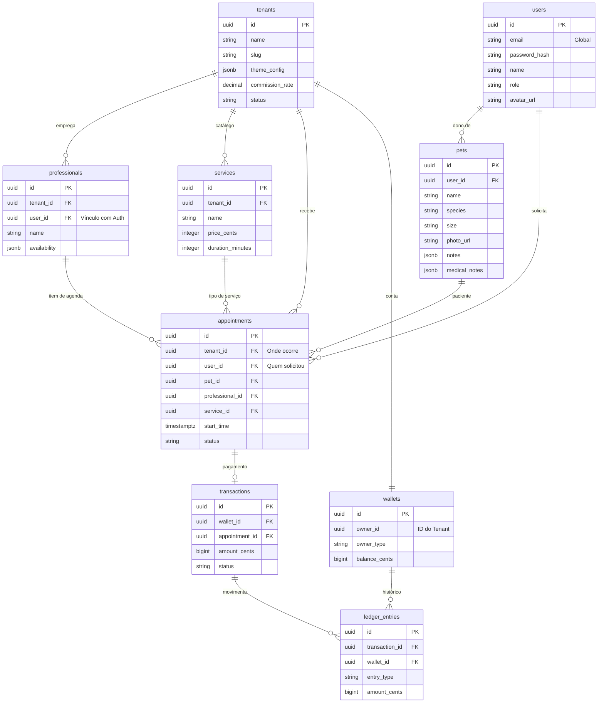
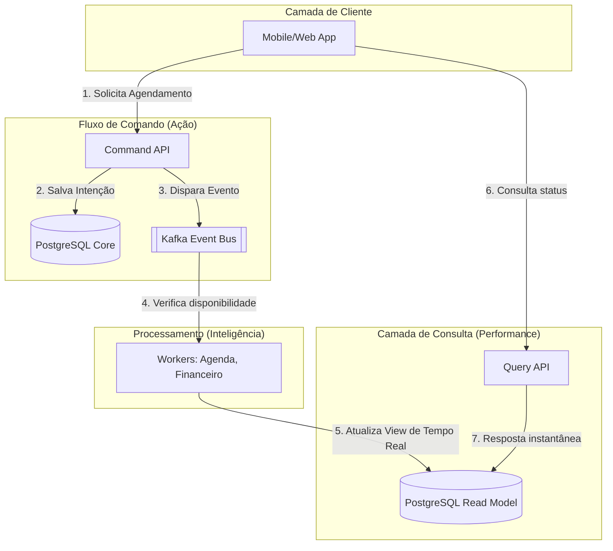

# Data Models (Petoo)

O Petoo utiliza uma arquitetura **CQRS**, separando os modelos de escrita (**Write Model**) dos modelos de consulta (**Read Model**).

## Esquemas de Banco de Dados

### 1. Schema `core`
Contém os dados primários de negócio e o modelo de escrita.

| Tabela | Descrição |
|--------|-----------|
| `tenants` | Configurações de cada petshop (white-label) |
| `users` | Usuários da plataforma (Clientes, Admins, Staff) |
| `pets` | Animais de estimação vinculados aos usuários |
| `professionals` | Funcionários que prestam serviços |
| `services` | Catálogo de serviços oferecidos |
| `appointments` | Registro principal de agendamentos |

### 2. Schema `financial`
Gerencia a carteira (wallet) e o ledger imutável.

| Tabela | Descrição |
|--------|-----------|
| `wallets` | Saldo de tenants e da plataforma |
| `transactions` | Transações vinculadas a pagamentos |
| `ledger_entries` | **Tabela Imutável**. Registro de cada centavo movimentado |

### 3. Schema `read_model`
Views e tabelas desnormalizadas otimizadas para leitura rápida (Query API).

| Tabela | Descrição |
|--------|-----------|
| `appointments_view` | Registro completo do agendamento com JSONB (Zero JOINs) |
| `schedule_slots_view` | Cache de slots de tempo disponíveis/ocupados |
| `tenant_dashboard_view` | Agregados de performance para o dashboard |



## 2. Fluxo de Dados (Arquitetura CQRS)

O fluxo segue o padrão iFood: O usuário navega nos estabelecimentos, escolhe um serviço/profissional e o sistema processa a reserva de agenda de forma assíncrona.



## Estrutura JSONB Sugerida (Read Model)
Na tabela `read_model.appointments_view`, o campo `data` armazena o objeto completo para evitar joins e garantir performance máxima no frontend:

```json
{
  "appointment": { "id": "uuid", "startTime": "..." },
  "user": { "name": "João", "email": "..." },
  "pet": { "name": "Rex", "species": "DOG" },
  "professional": { "name": "Maria" },
  "service": { "name": "Banho", "priceCents": 5000 }
}
```
